<h2 align="center">Hi! My name is <strong>Shivam Shukla</strong> and I'm from <strong>India</strong></h2>
  

###

  

###

  

 <table>
    <tr>
      <td valign="top"></td>
      <td valign="top"></td>
    </tr>
  </table>

### its-shivam1008@github$ whoami

I'm a **Full-Stack Engineer** building **production-grade, scalable systems**.

I design for **scale, security, and speed** — the things that matter once real users show up.

- 🏗️ Building enterprise-grade platform with, multi-level approval workflows & data analytics
- 🔐 Strong in **RBAC, multi-tenant architecture & secure auth systems**
- ⚡ Backend performance — **Redis caching, DB indexing, and query optimization** for systems that stay fast under load
- 🌐 Full-stack across **Next.js, Node.js, MongoDB & Supabase/PostgreSQL**
- 📩 shivamshukla.email@gmail.com

<!-- Languages / Foundations -->
### Languages

  
  &nbsp;&nbsp;
  
  &nbsp;&nbsp;
  
  &nbsp;&nbsp;
  
  &nbsp;&nbsp;
  
  &nbsp;&nbsp;
  
  &nbsp;&nbsp;
  

 

<!-- AI / ML -->
### AI / ML

  
  &nbsp;&nbsp;
  
  &nbsp;&nbsp;
  
  &nbsp;&nbsp;
  

 

<!-- Frontend / App UI -->
### Frontend / App UI

  
  &nbsp;&nbsp;
  
  &nbsp;&nbsp;
  
  &nbsp;&nbsp;
  
  &nbsp;&nbsp;
  
  &nbsp;&nbsp;
  
  &nbsp;&nbsp;
  
  &nbsp;&nbsp;
  
  &nbsp;&nbsp;
  
  &nbsp;&nbsp;
  

 

<!-- Backend / APIs -->
### Backend / APIs

  
  &nbsp;&nbsp;
  
  &nbsp;&nbsp;
  
  &nbsp;&nbsp;
  
  &nbsp;&nbsp;
  
  &nbsp;&nbsp;
  
  &nbsp;&nbsp;
  

 

<!-- Databases / Caching -->
### Databases / Caching

  
  &nbsp;&nbsp;
  
  &nbsp;&nbsp;
  
  &nbsp;&nbsp;
  
  &nbsp;&nbsp;
  
  &nbsp;&nbsp;
  

 

<!-- DevOps / Cloud -->
### DevOps / Cloud

  
  &nbsp;&nbsp;
  
  &nbsp;&nbsp;
  
  &nbsp;&nbsp;
  
  &nbsp;&nbsp;
  
  &nbsp;&nbsp;
  
  &nbsp;&nbsp;
  
  &nbsp;&nbsp;
  
  &nbsp;&nbsp;
  
  &nbsp;&nbsp;
  
  &nbsp;&nbsp;
  

 

###

 

&nbsp;&nbsp;&nbsp;&nbsp;&nbsp;&nbsp;

###

 

  

###
